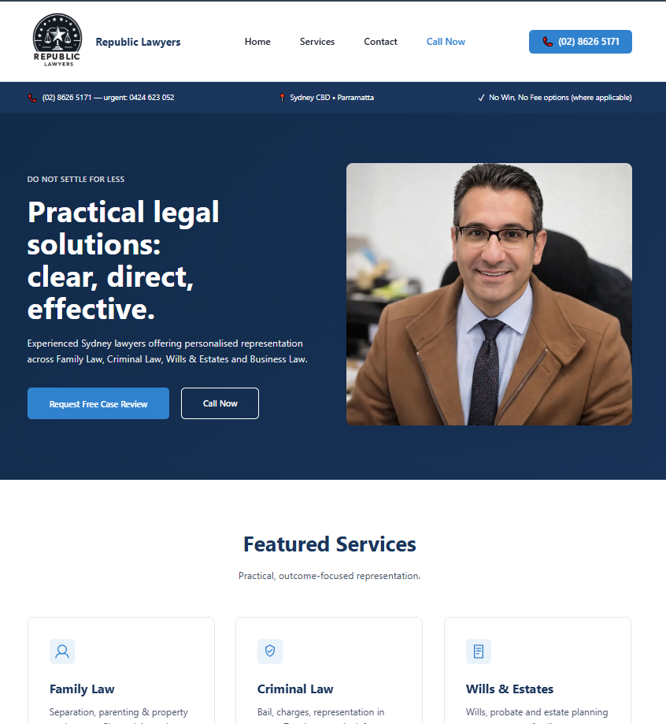

# Republic Lawyers Website

A modern, accessible, and SEO & LLMO optimized website for Republic Lawyers, built with static HTML, CSS, and vanilla JavaScript.



[ADD LIVE URL HERE]

## 🚀 Features

- **Modern Design**: Clean, professional UI with strong typography and restrained color palette
- **Fully Responsive**: Mobile-first design that works beautifully on all devices
- **Accessible**: WCAG compliant with ARIA labels, keyboard navigation, and screen reader support
- **SEO Optimized**: JSON-LD schema markup, semantic HTML, optimized meta tags
- **Performance Focused**: Pure HTML/CSS/JS with minimal dependencies, fast load times
- **Animation**: Smooth scroll-reveal animations and micro-interactions
- **Contact Forms**: Ready for backend integration

## 🛠️ Development

### Prerequisites
- A modern web browser
- A local web server (optional for development)

### Local Development

**Option 1: Python HTTP Server**
```bash
# Python 3
python -m http.server 8000

# Then visit http://localhost:8000
```

**Option 2: VS Code Live Server**
- Install "Live Server" extension
- Right-click index.html and select "Open with Live Server"

**Option 3: Node.js http-server**
```bash
npm install -g http-server
http-server -p 8000
```

## 🎨 Design System

### Colors
- **Primary**: Navy blue (#1a365d) - Authority and trust
- **Accent**: Bright blue (#3182ce) - Call-to-action elements
- **Text**: Dark gray (#1a202c)
- **Background**: White (#ffffff) and light gray (#f7fafc)

### Typography
- **Body**: 18px, system font stack (San Francisco, Segoe UI, Roboto)
- **Line Height**: 1.6 for readability
- **Headings**: Bold, responsive sizing with clamp()

### Breakpoints
- Mobile: < 768px
- Tablet: 768px - 1024px
- Desktop: > 1024px

### Making Changes

1. **Edit HTML pages** directly in the root or `/services` folder
2. **Update styles** in `styles/main.css`
3. **Modify JavaScript** in `scripts/main.js`
4. **Add images** to the `assets/` folder

### Form Integration

The contact form currently uses a placeholder action. To integrate with a backend:

1. Update the `action` attribute in the form:
   ```html
   <form action="YOUR_FORM_HANDLER_URL" method="POST">
   ```

2. Or implement JavaScript submission in `scripts/main.js` (already set up as an example)

Popular form services:
- [Formspree](https://formspree.io/)
- [Netlify Forms](https://www.netlify.com/products/forms/)
- [Basin](https://usebasin.com/)

## 📦 Deployment

### Netlify (Recommended)

1. Push code to GitHub/GitLab
2. Connect repository to Netlify
3. Deploy settings:
   - Build command: (leave empty)
   - Publish directory: `.` (root)
4. Add custom domain in Netlify settings

### Vercel

1. Install Vercel CLI: `npm i -g vercel`
2. Run `vercel` in project directory
3. Follow prompts

### GitHub Pages

1. Push to GitHub
2. Go to repository Settings > Pages
3. Select branch and root folder
4. Site will be available at `username.github.io/repo-name`

### Traditional Hosting (cPanel, etc.)

1. Upload all files via FTP
2. Ensure directory structure is maintained
3. Set index.html as default document

## ✅ Pre-Launch Checklist

- [ ] Add professional portrait image (`assets/javid-portrait.webp`)
- [ ] Add Open Graph image (`assets/og-default.jpg`)
- [ ] Add favicon (`assets/favicon.ico`)
- [ ] Replace placeholder form action with real handler
- [ ] Update domain in sitemap.xml (currently republiclawyers.com.au)
- [ ] Test all internal links
- [ ] Test form submission
- [ ] Run Lighthouse audit (aim for 90+ scores)
- [ ] Test on mobile devices
- [ ] Check accessibility with screen reader
- [ ] Verify all phone numbers and email addresses
- [ ] Set up Google Analytics (optional)
- [ ] Set up Google Search Console
- [ ] Submit sitemap to search engines

## 🔧 Customization

### Changing Colors

Edit CSS variables in `styles/main.css`:

```css
:root {
  --color-primary: #1a365d;
  --color-accent: #3182ce;
  /* ... other colors */
}
```

### Adding New Service Pages

1. Copy an existing service page (e.g., `services/family-law.html`)
2. Update content, title, meta description
3. Update JSON-LD schema with relevant service info
4. Add link to navigation in header
5. Add to sitemap.xml

### Modifying Animations

Animations can be adjusted in `styles/main.css`:
- Scroll reveal: `.reveal` class
- Button pulse: `.btn-pulse` animation
- Card hover: `.service-card:hover` effect

To disable animations, users can enable "Reduce Motion" in their OS settings (automatically respected).

## 📱 Browser Support

- Chrome (latest 2 versions)
- Firefox (latest 2 versions)
- Safari (latest 2 versions)
- Edge (latest 2 versions)
- Mobile browsers (iOS Safari, Chrome Mobile)

## 🔒 Security

- No external dependencies = minimal attack surface
- Forms should use HTTPS in production
- Consider adding CSP headers via hosting provider
- Keep form handler secure with reCAPTCHA

## 📊 Performance

Target metrics (run Lighthouse):
- Performance: 95+
- Accessibility: 100
- Best Practices: 100
- SEO: 100

Optimization tips:
- Images: Use WebP format, compress to < 200KB
- CSS: Already minified for production
- JS: < 10KB gzipped, loaded at end of body
- Fonts: Using system fonts (zero download)

## 📁 Project Structure

```
.
├── index.html                 # Homepage
├── contact.html              # Contact page
├── services/                 # Service pages
│   ├── family-law.html
│   ├── criminal-law.html
│   ├── wills-estates.html
│   ├── business-law.html
│   ├── commercial-contracts.html
│   └── dispute-resolution.html
├── styles/
│   └── main.css             # Main stylesheet
├── scripts/
│   └── main.js              # JavaScript functionality
├── components/              # Reusable HTML components (reference only)
│   ├── header.html
│   ├── footer.html
│   └── service-card.html
├── assets/                  # Images and media files
│   ├── javid-portrait.webp # Hero image (TO ADD)
│   ├── og-default.jpg      # Open Graph image (TO ADD)
│   └── favicon.ico         # Favicon (TO ADD)
├── content/
│   └── seeds.json          # LLMO content seeds for AI tools
├── sitemap.xml             # XML sitemap
├── robots.txt              # Robots.txt
└── README.md               # This file
```

## 📞 Support

For questions about the website build:
- Review `build_specs.md` for original requirements
- Check `content/seeds.json` for content guidelines

## 📄 License

© 2025 Republic Lawyers Pty Ltd. All rights reserved.

---

Built with care by Serenity WebCrafts following modern web standards and accessibility guidelines.

